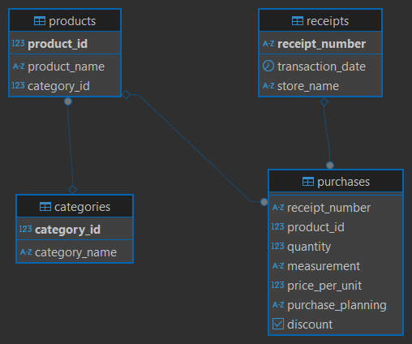

# Food Purchase Analysis Project
## Overview
This project analyzes personal food purchase data collected over the last 3 months. The goal is to extract insights about purchase patterns, identify spontaneous purchases, and create interactive dashboards for visualization using SQL and Power BI.
## Objectives
- Analyze personal food purchase data
- Identify trends and behavioral patterns
- Investigate spontaneous purchases
- Develop visualizations in Power BI for intuitive understanding
## Tech Stack
- PostgreSQL: For storing and querying purchase data
- Power BI: For creating interactive dashboards
## Data Limitations
- Only 3 months of data are available
- Limited seasonal trend analysis due to the short time frame
## Data Description
The database consists of multiple related tables that store food purchase transactions. The key entities include:
- **Products**: Contains details of available products
- **Categories**: Groups products into broader categories
- **Receipts**: Contains details of all receipts
- **Purchases**: Links receipts with specific products and quantities

For a detailed view of the database structure, refer to the ER diagram below:

