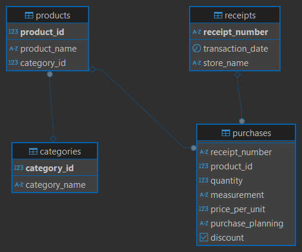

# Food Purchase Analysis Project
## Overview
This project analyzes personal food purchase data collected over the last 3 months. The goal is to extract insights about purchase patterns, identify impulsive purchases, and create interactive dashboards for visualization using SQL and Power BI.
## Objectives
- Analyze personal food purchase data
- Identify trends and behavioral patterns
- Investigate impulsive purchases
- Develop visualizations in Power BI for intuitive understanding
## Tech Stack
- PostgreSQL: For storing and querying purchase data
- Power BI: For creating interactive dashboards
- Excel: For data preprocessing and additional analysis
## Data Limitations
- Only 3 months of data are available
- Limited seasonal trend analysis due to the short time frame
## Data Description
The database consists of multiple related tables that store food purchase transactions.The data has been normalized to improve database structure and reduce duplication. This normalization approach helps minimize data redundancy, optimize storage, and simplify data analysis. The key entities include:
- **Products**: Contains details of available products
- **Categories**: Groups products into broader categories
- **Receipts**: Contains details of all receipts
- **Purchases**: Links receipts with specific products and quantities

For a detailed view of the database structure, refer to the ER diagram below:



## Usage
Run SQL queries from [sql/queries.sql](sql/queries.sql) for specific analyses.  
Use Power BI to explore and interact with the dashboards.  
## Example Queries
### Top Categories with Highest Purchase Volume
```sql
WITH ranked_categories AS (
    SELECT 
        c.category_name, 
        ROW_NUMBER() OVER (
            ORDER BY SUM(
                CASE 
                    WHEN p.measurement = 'kg' THEN 1
                    ELSE p.quantity
                END
            ) DESC
        ) AS row_nmb,
        SUM(
            CASE 
                WHEN p.measurement = 'kg' THEN 1
                ELSE p.quantity
            END
        ) AS quantity
    FROM purchases p
    LEFT JOIN products t ON t.product_id = p.product_id
    LEFT JOIN categories c ON c.category_id = t.category_id
    WHERE c.category_name <> 'Non-food products'
    GROUP BY c.category_name
)
SELECT 
    CASE 
        WHEN row_nmb <= 3 THEN category_name 
        ELSE 'Other'
    END AS category,
    SUM(quantity) AS purchase_quantity,
    ROUND(SUM(quantity)::NUMERIC * 100 / SUM(SUM(quantity)::NUMERIC) OVER (), 0) AS percentage_of_total
FROM ranked_categories
GROUP BY category
ORDER BY purchase_quantity DESC;
```
### Day of the Week with the Highest Average Receipt
```sql
SELECT 
    to_char(r.transaction_date, 'day') AS week_day,
    ROUND(CAST(SUM(p.quantity * p.price_per_unit) / COUNT(DISTINCT r.receipt_number) AS numeric), 0) AS Expenses
FROM receipts r
RIGHT JOIN purchases p USING (receipt_number)
GROUP BY week_day
ORDER BY Expenses DESC;
```
### Impact of Discounts on the Impulse Purchase Items
```sql
SELECT 
    'Percentage of discounted products among unplanned purchases' AS INDICATOR,
    ROUND((
        (COUNT(*) / (
            SELECT COUNT(*) AS plan_purchase
            FROM purchases p 
            WHERE purchase_planning = 'unplanned'
        )::NUMERIC) * 100), 2) AS Percentage
FROM purchases p 
WHERE discount = TRUE AND purchase_planning = 'unplanned'

UNION ALL

SELECT 
    'Percentage of discounted products among planned purchases' AS INDICATOR,
    ROUND((
        (COUNT(*) / (
            SELECT COUNT(*) AS plan_purchase
            FROM purchases p 
            WHERE purchase_planning = 'planned'
        )::NUMERIC) * 100), 2) AS Percentage
FROM purchases p 
WHERE discount = TRUE AND purchase_planning = 'planned';
```
## Visualization in Power BI
--
## Insights & Conclusions
--
## Future Improvements
- Collect more data for long-term trend analysis
- Explore machine learning techniques to predict spontaneous purchases
